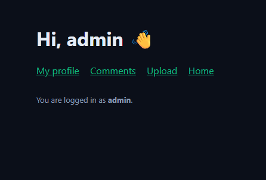
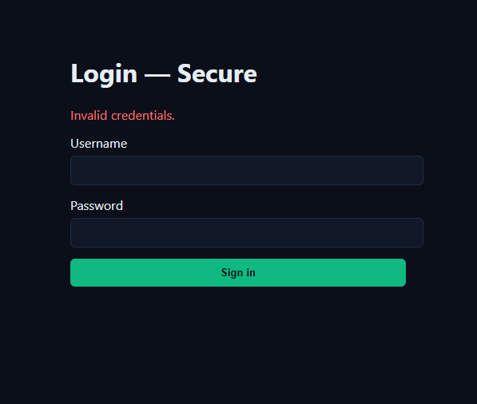
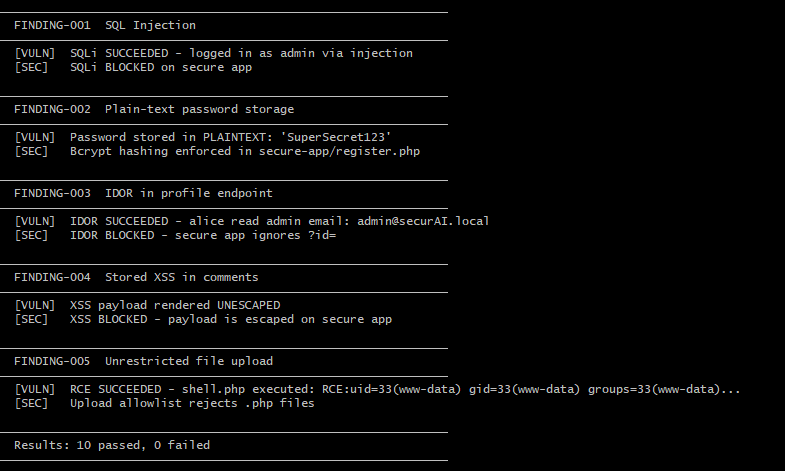

# 🔬 SecurAI Vuln Lab

A deliberately vulnerable PHP/MySQL application built to demonstrate the 5 most common OWASP Top 10 vulnerabilities — and their fixes.

**WARNING: This app is intentionally insecure. It exists only for education and portfolio purposes. Never deploy vuln-app/ on any internet-facing server. Use Docker in an isolated environment.**

## Demo

### SQL Injection - exploitable in the vulnerable app

### Same attack — blocked in the secure app

### Automated test suite — 10/10 tests pass

## What's inside

| # | Vulnerability | OWASP | File |
|---|---|---|---|
| 1 | SQL Injection | A03:2021 | vuln-app/login.php |
| 2 | Plain-text password storage | A02:2021 | vuln-app/register.php |
| 3 | IDOR (Insecure Direct Object Reference) | A01:2021 | vuln-app/profile.php |
| 4 | Stored XSS | A03:2021 | vuln-app/comment.php |
| 5 | Unrestricted File Upload | A04:2021 | vuln-app/upload.php |

Every vulnerability has:

- A working exploit script in tests/exploit.sh
- A documented finding in report/SECURITY-REPORT.md
- A fixed version in secure-app/

## Quick start

Run these commands in your terminal:

    git clone https://github.com/ElhamBidarigh/securAI-vuln-lab.git
    cd securAI-vuln-lab
    docker compose up -d

Then open:

- Vulnerable app: http://localhost:8081
- Secure app: http://localhost:8082
- phpMyAdmin: http://localhost:8083

Default login: admin / admin123

## Run the exploits

Run the automated test suite that proves each vulnerability exists in vuln-app/ and is fixed in secure-app/:

    chmod +x tests/exploit.sh
    ./tests/exploit.sh

Expected output: **10 passed, 0 failed**

## Try the attacks yourself

### SQL Injection

1. Go to http://localhost:8081/login.php
2. Username: `' OR '1'='1' -- ` (with trailing space)
3. Password: anything
4. Click Sign in — you're logged in as admin without a password

### IDOR

1. Log in as alice / alice123
2. Visit http://localhost:8081/profile.php?id=1
3. You can see admin's email, role, and bio

### Stored XSS

1. Log in and go to http://localhost:8081/comment.php
2. Post: ``
3. Reload http://localhost:8081/ — the script fires in every visitor's browser

### File Upload to RCE

1. Save a file named `shell.php` with content: `<?php system($_GET["c"]); ?>`
2. Upload it at http://localhost:8081/upload.php
3. Visit http://localhost:8081/uploads/shell.php?c=id — arbitrary command execution

## Automated security scan

This repository ships with a GitHub Actions workflow that runs on every PR and push. It combines Gitleaks, Semgrep, and dependency audits into a single beautiful HTML report.

See .github/workflows/security-scan.yml

Note: The workflow is expected to fail on this repo — that's the point. It demonstrates SecurAI's ability to detect real vulnerabilities in real code.

## Full audit report

See report/SECURITY-REPORT.md — a real pentest-style report with CVSS scores, PoCs, and remediation.

## The full SecurAI toolkit

| Tool | Type | Link |
|------|------|------|
| 🛡️ Audit Tool | Self-assessment (browser) | [Live demo](https://elhambidarigh.github.io/securai/) |
| 🔬 Vuln Lab | Educational (PHP/MySQL) | You are here |
| ⚙️ Security Action | CI/CD (GitHub Actions) | [Workflow](.github/workflows/security-scan.yml) |
| 🔍 Active Scanner | Live URL scanner (PHP) | [Repo](https://github.com/ElhamBidarigh/securAI-active-scanner) |

## Tech stack

- PHP 8.3 (Apache)
- MySQL 8.0
- Docker Compose
- Bash test suite

## License

MIT — for educational use only.
